Demo Video : <https://youtu.be/YEryZz5YnOM/>

# Introduction

First of all, thank you for looking to this project. This is my first big project compared to the assignment I did before.

This project is a face recognition system that contains liveness detection functions (FRLD) that detects if the person in front of the camera is a real person or not.

The `README.md` will separate into 5 parts:

1. Prerequisite :- It will explain the environment needed to setup the system like Operating System, Computer’s specification and Python Environment.
2. Source code Files Structure :- The file structure of the source code folder.
3. Codebase of every liveness module: The liveness detection code explained with the aid of the output images.
4. Codebase of FastAPI server: The FRLD system with Rest API based code.
5. Codebase of Android Prototype:- The Android code that used in prototype application.

# Prerequisite

## Computer Specification

During the building of this project, the computer that I used is workstation spec. But, when testing to host web API on my laptop it’s running smoothly also.

1. Server spec

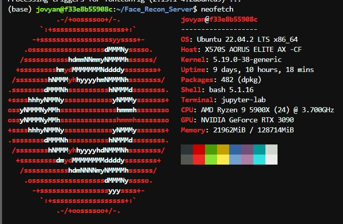
- 1. Operating system: Ubuntu Linux 22.04 LTS
  2. CPU: AMD Ryzen 9 5900X (12 Cores, 24 Thread)
  3. GPU: Nvidia GeForce RTX 3090 (24 VRAM for Deep Learning)
  4. RAM: 128GB

1. My personal computer’s spec

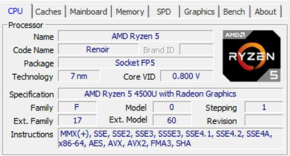
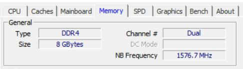
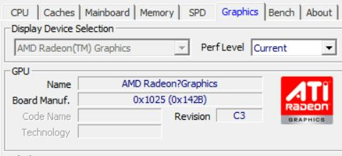
- 1. Operating system: Windows 10 Home 21H2
  2. CPU: AMD Ryzen 5 4500U (6 Cores, 6 Thread)
  3. GPU: Radeon RX Vega 6 (Not supported in CUDA Deep Learning)
  4. RAM: 8GB

It is suggested to have a high end specification PC when having training on the Tensorflow CNN model. But when hosting the API, the consideration of GPU can be ignored as Tensorflow allows GPU-trained models to run in CPU mode.

In conclusion, the suggested specification for the workstation that can train and host an API server would be:

1. Operating System: Ubuntu Linux 20.04 LTS
2. CPU: 8 Core 16 Thread. Example: Intel Core i7-11700, AMD Ryzen 7 5800X
3. GPU: 8GB VRAM. Example: Nvidia GeForce RTX 3050, Nvidia GeForce RTX 2070
4. RAM: 32GB

## Software Requirements: Python

During the development of the FRLD system, the whole development is proceeding on Jupyter Lab as the remote IDE that allows developers to access and code from the browser instead of remote access to the server.

For the Python version that I used in development and deployment is Python 3.8, the installed libraries will be included in the source code folder as a text file named in requirements.txt.

These are the suggested software for development and deployment of API server:

Integrated Development Environment (IDE): Jupyter Notebook, Microsoft Visual Studio Code

Python version: Python 3.8

Also, because the server are hosting on docker, the start command for the container would be:

docker run --gpus all -d -it -p 10077:8888 -p 10078:5000 --name &lt;name of container&gt; -e GRANT_SUDO=yes --user root -v "$1":/home/jovyan/work jupyter/tensorflow-notebook:latest

This command launches a Docker container using the jupyter/tensorflow-notebook:latest image, which is a pre-configured image for running Jupyter notebooks with the TensorFlow machine learning framework installed.

Here is a breakdown of the various options used in this command:

docker run: starts a new container

`--gpus all`: enables GPU support for the container

`-d`: runs the container in detached mode (i.e., in the background)

`-it`: attaches an interactive terminal to the container

`-p 10077:8888`: maps port 8888 (the default Jupyter Notebook port) inside the container to port 10077 on the host machine, allowing you to access the Jupyter Notebook running in the container via your web browser at <http://localhost:10077>

`-p 10078:5000`: maps port 5000 inside the container to port 10078 on the host machine, allowing you to access other services running in the container via your web browser at <http://localhost:10078>

`--name <name of container>`: sets the name of the container

`-e GRANT_SUDO=yes`: sets the GRANT_SUDO environment variable to yes, which allows the jovyan user (the default user in the Jupyter/TensorFlow image) to run commands with elevated privileges using sudo

`--user root`: sets the user inside the container to root

`-v "$1":/home/jovyan/work`: mounts a volume from the host machine into the container, allowing you to share files between the host and the container. The $1 variable is a placeholder for the path to the host directory that you want to mount.

`jupyter/tensorflow-notebook:latest`: the name and version tag of the Docker image to use for the container. This is a pre-built image with the latest version of Jupyter and TensorFlow installed.

## Software Requirements: Android Prototype

The Android development are using the latest (till 15-Apr-2023) version of Android Studio, Android Studio Electric Eel | 2022.1.1 (Jan 2023).

The SDK compile version is Android API 33

The extra library included in project:

`implementation "com.android.volley:volley:1.2.1"`

For further configuration please refer to gradle scripts.

# Source code Files Structure

In the source code folder, there will be 3 sub-folders and 1 text file:

1. FYP_FRLD_Android => Android project folder that ables to access by Android Studio
2. Module_Testing => Folder that contains source code during development of system
3. Face_Recon_Server => Folder of Python script and resource that runs web API server

##

# Codebase of every liveness module

## Face direction module (for shaking/nodding detection)

The module basically builds on the MediaPipe Python library. The basic concept is to convert the face landmarks into 2D points that determine the direction of the face.

By using the FaceMesh solution from mediapipe, we can draw out the FaceMesh (which is landmarks) of our face.

```
# FaceMesh Solution

mp_face_mesh = mp.solutions.face_mesh

# FaceMesh Object

face_mesh = mp_face_mesh.FaceMesh(min_detection_confidence=0.5, min_tracking_confidence=0.5)

# And input the frame into the FaceMesh Object

# Get the result

results = face_mesh.process(frame)
```

For further codes please look at `Sourcecode\Module_Testing\prototype_liveness_detect.ipynb`, it basically calculates the nose landmarks distance to the center of the face. And converts it into X, Y and Z axes. The X and Y axis is the point that determines the direction of the face.

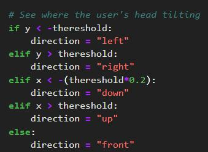
The threshold value can be tuned for the best sensitivity. When the value is more than the threshold value, it is considered as the direction. Example for the X axis, if X more than positive threshold value the face will be considered as facing the right side, and negative threshold is the left side.

## Tensorflow Model related module: Face smiling and Eyes Blinking

For the two Tensorflow CNN models, the cropping of the image is necessary to ensure the good accuracy in the real situation of detection.

For the face smiling, it will be using cv2 cascade face classifier in cropping the face.

Source: `SourceCode/Module_Testing/Smile_Detection_Train/Train_Smile_Model.ipynb`

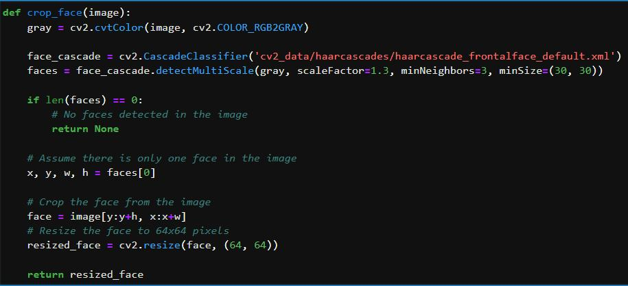
Example output (compared to input image):


For the cropping of left eye + right eye, the cv2 cascade left eye and right eye classifier used in cropping the eyes.

Source: `SourceCode/Module_Testing/Eyes_Detection_Train/Train_Blink_Model.ipynb`

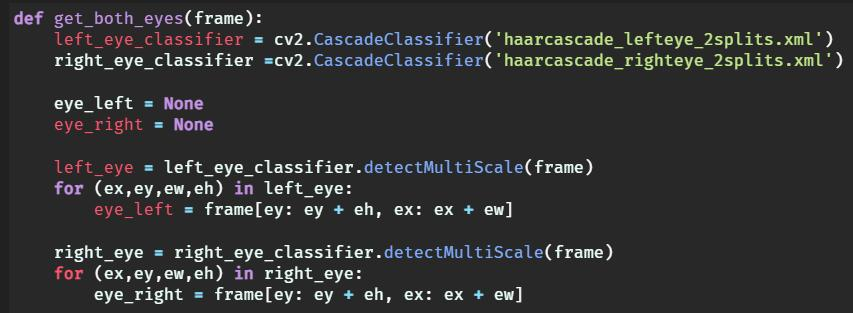
Example output:

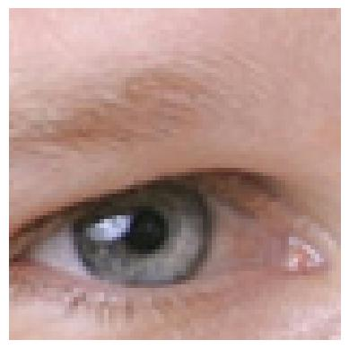
The training of the tensorflow model please refer to this link : <https://www.analyticsvidhya.com/blog/2020/10/create-image-classification-model-python-keras/>

## dlib related module: Mouth Opening

The face is landmarked and calculate the distance between up lip and down lip. The distance between is called Mouth Aspect Ratio (MAR). When MAR is bigger than allocated threshold, the mouth is considered open.

Source: `SourceCode/Module_Testing/Module_Testing/prototype_liveness_detect.ipynb`

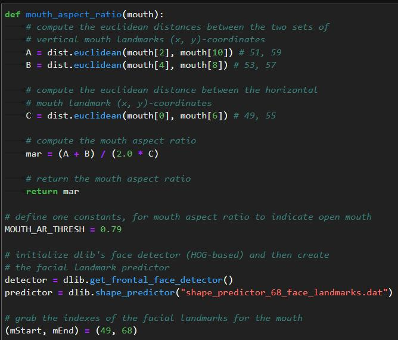
Example Output:

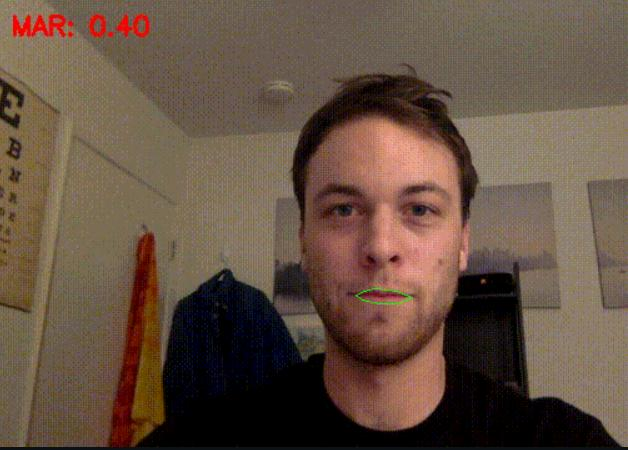
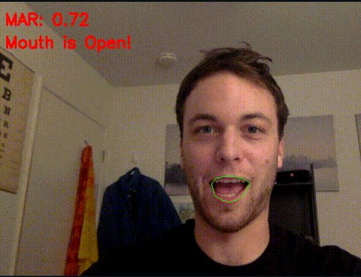
# Cadebase of FastAPI server

The structure of the API server source code file will be like:
```

| draft_py

| output.doc

| server.py

| Untitled.ipynb

+---cv2_data

+---model

\\---people_images
```
How to start the server:

1. Access the API server folder from terminal
2. Using `uvicorn server:app --reload --host 0.0.0.0 --port 5000` (PLEASE MAKE SURE your Python environment is installed libraries in requirements.txt)
3. Waiting for message of “Application startup complete” shown up

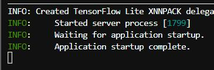
4. When server start complete, try to access <https://localhost:5000/docs> to check weather the API documentation is able to access or not. If not, the server may locate to other port, please check the start message in terminal for port that uvicorn auto host to.

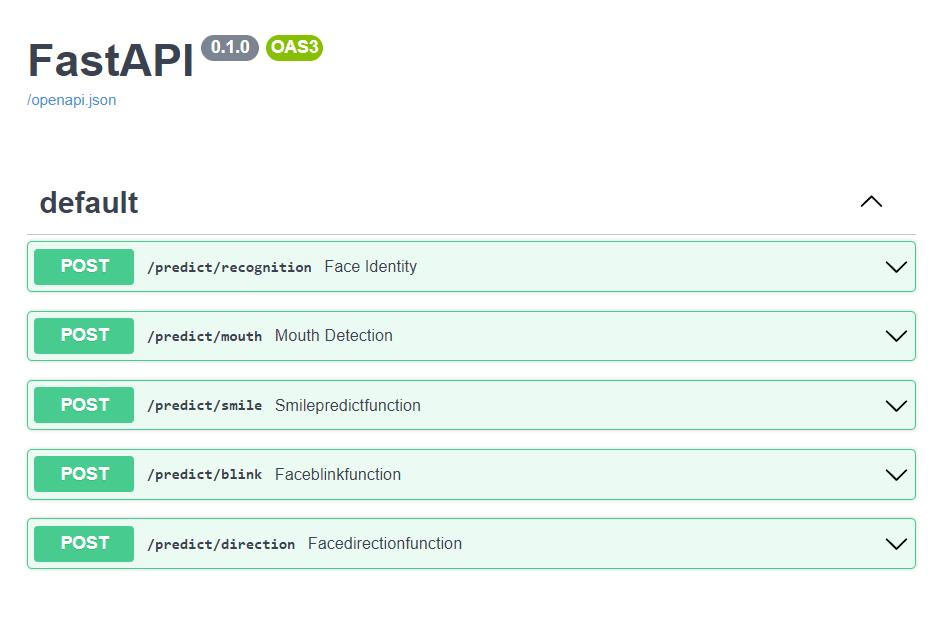
# Codebase of Android Prototype

Please access the android prototype folder using Android Studio.

Android prototype folder location: **final_year_project\\Sourcecode\\FYP_FRLD_Android**

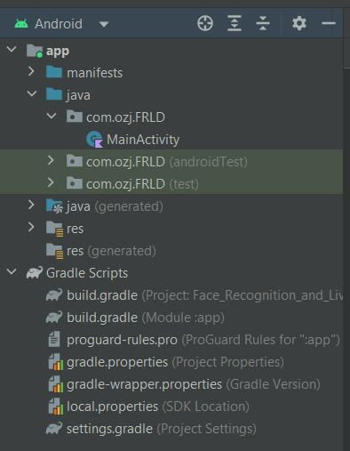
This is the structure of the prototype folder. The source code file is only a kotlin file in java > com.ozj.FRLD > MainActivity.

The only 3rd party library (other than native android library) is Volley, import in build.gradle (Module:app) like this:

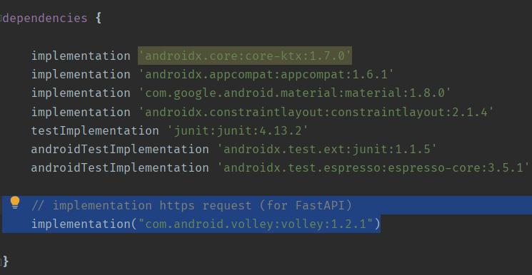
Please ensure the URL link of the API server before the android prototype is build into APK file to install in the mobile device.

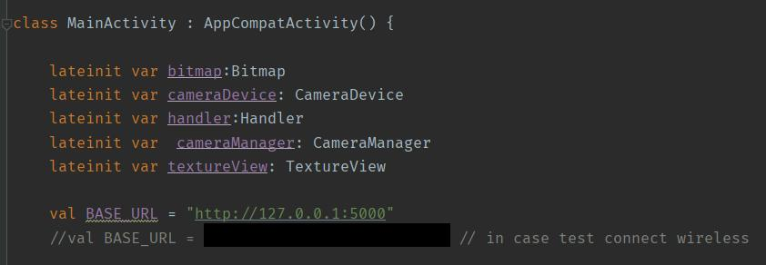
For the real time capturing using Android Camera2 library please refer to this link:

<https://youtu.be/zs43IrWTzB0>