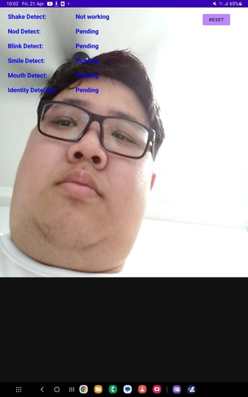
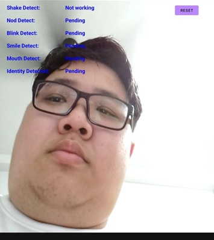
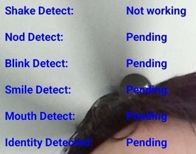
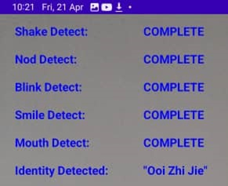
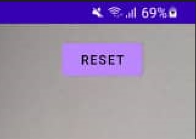
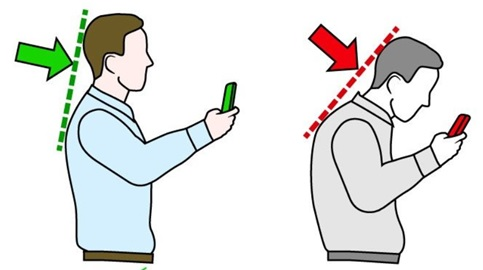

# Introduction

First of all, thank you for using this product although it is still a prototype to demonstrate the real-life situation when deploying the web API based face recognition system with liveness detection.

This user manual will explain the prerequisite of using this application, the information when using the application and possible issues facing when using this application.

The user manual will separate into 3 parts:

1. Prerequisite:- It will explain the precondition like AndroidOS version requires
2. Interface and Information:- The application’s User Interface will explain here.
3. Possible Problem:- The possible problems that the user is facing when using this application.

# Prerequisite

## Device specification

It’s suggested to meet the requirements below to prevent application crashes as the SDK compiled for the prototype application is Android API 33 (AndroidOS 13).

Android Version:- AndroidOS 13 (Suggested), ColorOS 11.1 (AndroidOS 11, Tested without error), OneUI 5.0 (AndroidOS 13, Tested without error)

Device RAM: - 4GB (Suggested), ~3GB (Tested without crash)

Network: Wifi or Mobile Data both works

Front Camera: Necessary, else application won't be able to detect you as it can’t send the image captured to web API server.

# Interface and Information

## Interface

The interface of the prototype will be like this:

When the application starts up it will immediately enter the liveness detection procedure. You can see there’s only 3 parts in the prototype.

1. Camera Image :-

The image the front camera receive will showing in this part, you can directly starts the detection after the application started up.

1. Detection Information Panel

It will show the detection status when receiving proper data from the web API server. The first to the last detection will be:

- 1. Head Shaking Detection
- User will need to turn their face to left and to right, vice versa. The API will return the face direction that User facing during the detection. The detection will COMPLETE when the user performs the facing left and facing right.
    1. Nod Detection
- User will need to face down their head. The API will return the face direction that User facing during the detection. The detection will COMPLETE when the user performs the facing down.
    1. Eye-Blink Detection
- User will need to blink their eyes. The API will return the “0” when the eyes are opened and “1” when the server detects the user blinks their eyes. The detection will COMPLETE when the user performs eye blinking.
    1. Smile Detection
- User will need to make a smile face. The API will return the “0” when the face detected is not smiling and “1” when the server detects the user smiles. The detection will COMPLETE when the user performs eye blinking.
    1. Mouth Opening Detection
- User will need to open their mouth. The API will return the “0” when the mouth is closed and “1” when the server detects the user opening their mouth. The detection will COMPLETE when the user performs eye blinking.
    1. Face recognition
- Only enable to proceed after all the liveness detection proceeded and show COMPLETE at status bar.

1. Reset Button

When the user does the liveness detection and identity verification, the reset button is able to set all detect status back to the start.

# Possible Problem

## Detection Status Shows “Not Working”

This status happens when the API returns response other than detection result, please ensure that

1. You having internet connection on your phone
2. The camera is unable to capture the face, please ensure the mobile device holding posture related to posture below:

- The face should face horizontally to the phone camera, avoid to look down as it may affect the accuracy of face capturing.

1. If the solution above still didn’t solve your problem, please contact the developer team.
    1. Contact: [ooizj-pm18@student.tarc.edu.my](mailto:ooizj-pm18@student.tarc.edu.my)
    2. Or the supervisor of the project: [limtm@tarc.edu.my](mailto:limtm@tarc.edu.my)

## Reset Button Not Found

Please contact the developer when you are facing this problem, as the User Interface of the prototype may not fulfill every handphones’ resolution.

Contact: [ooizj-pm18@student.tarc.edu.my](mailto:ooizj-pm18@student.tarc.edu.my)